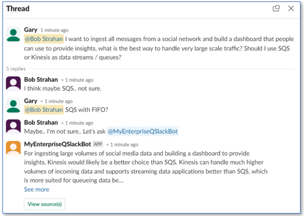

# Slack gateway for [[AWS Enterprise Q]]

[[AWS Enterprise Q]] is a new generative AI-powered application that helps users get work done. Use [[AWS Enterprise Q]] to discover content, brainstorm ideas, or create summaries using your company’s data safely and securely without needing to have any generative AI expertise. For more information see: [Introducing AWS Enterprise Q — A generative AI-powered application that transforms how employees get work done](TBD)

In this repo we share a project which lets you bring the power of [[AWS Enterprise Q]] to your users where they already spend a lot of their time collaborating with colleagues... on Slack. Now they can collaborate with [[AWS Enterprise Q]] as well! It allows your users to:
- Converse with [[AWS Enterprise Q]] using Slack Direct Message (DM) to ask questions based on company data, get help creating new content and performing tasks. 
- You can also invite it to participate in your team channels. 
  - In a channel users can ask it questions in a new message, or tag it in a thread at any point. Get it to provide additional data points, resolve a debate, or summarize the conversation and capture next steps. 

It's amazingly powerful. Here's a demo - seeing is believing!
 
<TODO - Update demo - use animated gif>  


It's easy to deploy in your own AWS Account, and add to your own Slack Workspace. We show you how below.

### Features
- In DMs it responds to all messages
- In channels it responds only to @mentions, and always replies in thread
- Renders answers containing markdown - e.g. headings, lists, bold, italics, tables, etc. 
- Provides thumbs up / down buttons to track user sentiment and help improve performance over time
- Provides Source Attribution - see references to sources used by [[AWS Enterprise Q]]
- Aware of conversation context - it tracks the conversation and applies context
- Aware of multiple users - when it's tagged in a thread, it knows who said what, and when - so it can contribute in context and accurately summarize the thread when asked.  
- *Process attached files for document question answering, summaries, etc. (pending)*

This sample [[AWS Enterprise Q]] slack application is provided as open source — use it as a starting point for your own solution, and help us make it better by contributing back fixes and features via GitHub pull requests. Explore the code, choose Watch to be notified of new releases, and check back for the latest  updates.

Follow the instructions below to deploy the project to your own AWS account and Slack workspace, and start experimenting!

## Deploy the solutiom

### 1. Dependencies

You need to have the following packages installed on your computer to build and deploy the project.

1. node and npm: https://docs.npmjs.com/downloading-and-installing-node-js-and-npm 
1. tsc (typescript): `npm install -g typescript`
2. esbuild: `npm i -g esbuild`
3. jq: https://jqlang.github.io/jq/download/
4. aws (AWS CLI): https://docs.aws.amazon.com/cli/latest/userguide/getting-started-install.html 
3. cdk (AWS CDK): https://docs.aws.amazon.com/cdk/v2/guide/cli.html

### 2. Initialize and deploy the stack

Copy the GitHub repo to your computer. Either:
- use the git command: git clone https://github.com/aws-samples/THISREPO.git
- OR, download and expand the ZIP file from the GitHub page: https://github.com/aws-samples/THISREPO/archive/refs/heads/main.zip

Navigate into the project root directory and run:

1. `./init.sh` - checks your system dependendencies for required packages (see Dependencies above), sets up your environment file, and bootstraps your cdk environment. 
2. `./deploy.sh` - runs the cdk build and deploys or updates a stack in your AWS account, creates a slack app manifest file, and outputs a link to the AWS Secrets Manager secret that you will need below.


### 3. Configure your Slack application

#### 3.2 Create your app

Now you can create your app in Slack!

1. Create a Slack app: https://api.slack.com/apps from the generated manifest `./slack-manifest-output.json` (copy / paste)
2. Go to `App Home`, scroll down to the section `Show Tabs` and enable `Message Tab` then check the box `Allow users to send Slash commands and messages from the messages tab` - This is a required step to enable your user to send messages to your app

#### 3.3 Add your app in your workspace

Let's now add your app into your workspace, this is required to generate the `Bot User OAuth Token` value that will be needed in the next step

1. Go to OAuth & Permissions (in api.slack.com) and click `Install to Workspace`, this will generate the OAuth token
2. In Slack, go to your workspace
2. Click on your workspace name > Settings & administration > Manage apps
3. Click on your newly created app
4. In the right pane, click on "Open in App Directory"
5. Click "Open in Slack"

### 4. Configure your Secrets in AWS

Let's configure your Slack secrets in order to (1) verify the signature of each request, (2) post on behalf of your bot

> **IMPORTANT**
> In this example we are not enabling Slack token rotation. Enable it for a production app by implementing
> rotation via AWS Secrets Manager. 
> Please create an issue (or, better yet, a pull request!) in this repo if you want this feature added to a future version.

1. Login to your AWS console
2. In your AWS account go to Secret manager, using the URL that was output by the `deploy.sh` script above. 
3. Choose `Retrieve secret value`
4. Choose `Edit`
5. Replace secret value with the following JSON and replace with the value of `Signing Secret` and `Bot User OAuth Token`, you will find those values in the Slack application configuration under `Basic Information` and `OAuth & Permissions`:
```
{
  "SlackSigningSecret": "VALUE_HERE",
  "SlackBotUserOAuthToken": "VALUE_HERE"
}
 ```

### Say hello
> Time to say Hi!

1. Go to Slack
2. Write a message to your bot

## Security

See [CONTRIBUTING](CONTRIBUTING.md#security-issue-notifications) for more information.

## License

This library is licensed under the MIT-0 License. See the LICENSE file.